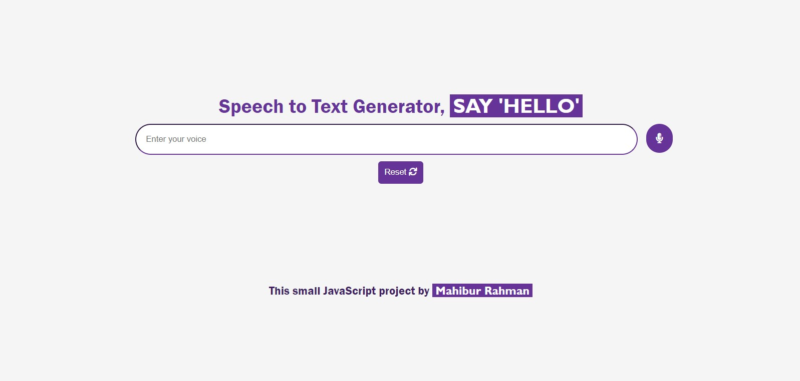

# Speech to Text Generator with JavaScript

## Licence

No Copyright, feel free to use for learn.

<!-- ## How does it work ?

First, the project include the [Android Things Library](https://developer.android.com/things/sdk/index.html). Then, it is separated into 3 activities :
 * HomeActivity : just here to launch others activities and to know current GPIO.
 * ButtonActivity : listen to BCM21 for a input (button) and launch LedActivity when button is pressed.
 * LedActivity : Output on BCM6 (low energy) and make blink a led.
 
That is the only things that make this little app ! -->
